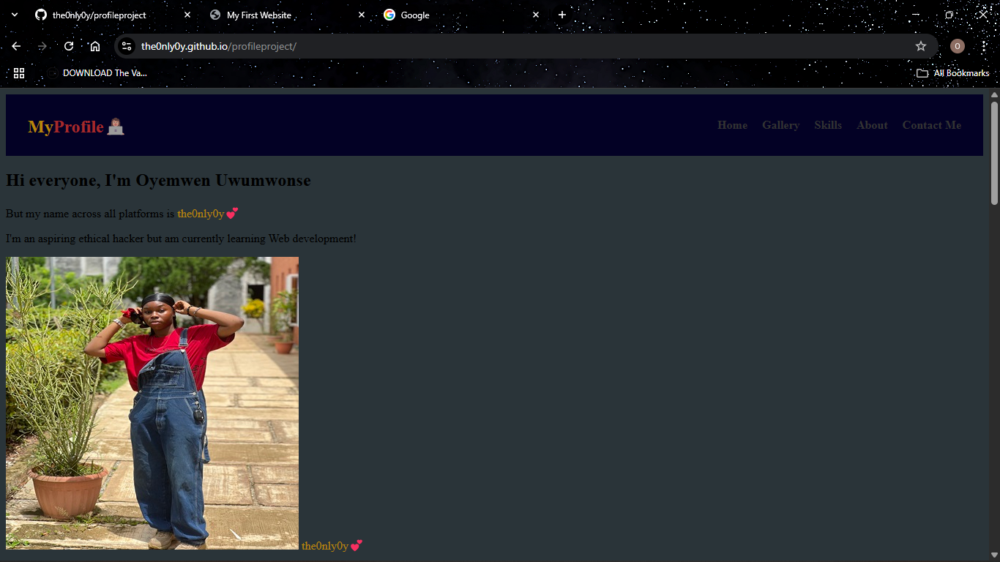

My Portfolio Website

Welcome to my Personal Portfolio! 
This site showcases my projects and skills as an aspiring Full-stack developer.
But for now it only includes a little information about me, my skills competency and some images of me. 

The Technology used are:
1. HTML
2. CSS [For styling the website]
3. Paint [I used it to resize and optimize the images for the web]
4. Github [For codes and file collaboration]
5. ChatGPT – [For guidance and troubleshooting layout, tags, and styling techniques].

What I've learned very well so far
1. I gained deeper understanding of HTML tags and their usage.
2. I improved my skills in creating and styling HTML tables effectively.
3. I learned how to apply row and column spanning within tables.
4. I Initially used a table to display images, then explored better alternatives
like the <gallery> tag (with guidance from ChatGPT) to enhance the layout and presentation.
5. How to write a clean and presentable HTML and CSS code
6. How to use Git/GitHub to manage a project(still learning it tho, It's very confusing)

The challenges I faced in this Recent Project
1. Aligning the page header to the right side of the layout.
2. Properly styling and organizing the table content for a cleaner look.
3. Adjusting the layout to be both visually appealing and functional.
4. Deciding on a clean and minimal design that reflects my personality
5. Pushing my project to Github

Here’s a preview of what the site looks like:

Click here to view my site live :
(https://the0nly0y.github.io/profileproject/)

> This project is part of my journey to becoming a better developer. 
> I'm always open for feedback it's all part of the learning process!.
